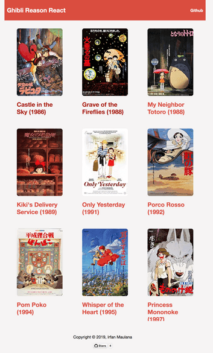

# Ghibli ReasonReact

[](#contributors) [](https://reasonml.github.io/reason-react/) [](https://travis-ci.org/mazipan/ghibli-reasonreact) [](https://greenkeeper.io/) [](https://app.netlify.com/sites/ghibli-reasonreact/deploys)

👻 Ghibli studio's film explorer built with [Reason React](https://github.com/reasonml/reason-react), based on [Reason React Hackernews Boilerplate](https://github.com/reasonml-community/reason-react-hacker-news)

## Live Demo

[https://ghibli-reasonreact.netlify.com](https://ghibli-reasonreact.netlify.com)

## Screenshoot



## Development

+ To install BuckleScript & Reason globally:

```bash
yarn global add bs-platform
```

+ You can run the app locally with:

```bash
yarn start
```

+ Build for production with:

```bash
yarn build
```

## Credits

+ [ReasonML](https://reasonml.github.io/)
+ [Reason React](https://github.com/reasonml/reason-react)
+ [React](https://reactjs.org/)
+ [Reason React Hackernews](https://github.com/reasonml-community/reason-react-hacker-news)
+ [Janaipakos](https://github.com/janaipakos) for awesome [Ghibli Studio API](https://ghibliapi.herokuapp.com/)

## Contributors

Thanks goes to these wonderful people ([emoji key](https://allcontributors.org/docs/en/emoji-key)):

<!-- ALL-CONTRIBUTORS-LIST:START - Do not remove or modify this section -->
<!-- prettier-ignore -->
<table><tr><td align="center"><a href="https://www.mazipan.xyz/"><br /><sub><b>Irfan Maulana</b></sub></a><br /><a href="https://github.com/mazipan/ghibli-reasonreact/commits?author=mazipan" title="Code">💻</a> <a href="#maintenance-mazipan" title="Maintenance">🚧</a> <a href="#design-mazipan" title="Design">🎨</a></td><td align="center"><a href="http://ridhoassuryadi.com"><br /><sub><b>Muhammad Ridho Assuryadi</b></sub></a><br /><a href="https://github.com/mazipan/ghibli-reasonreact/commits?author=muhammadridho" title="Code">💻</a></td></tr></table>

<!-- ALL-CONTRIBUTORS-LIST:END -->

This project follows the [all-contributors](https://github.com/all-contributors/all-contributors) specification. Contributions of any kind welcome!

---

Copyright © 2019 by Irfan Maulana